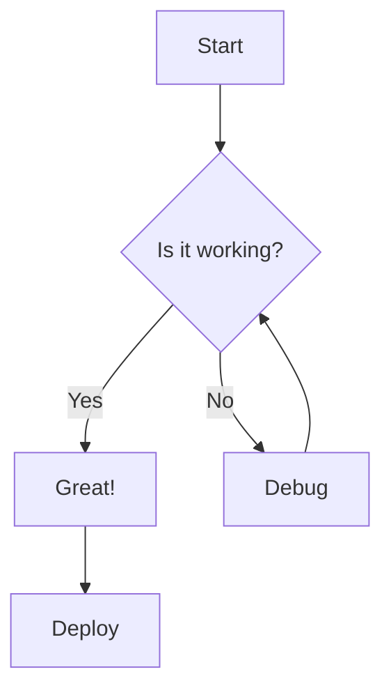
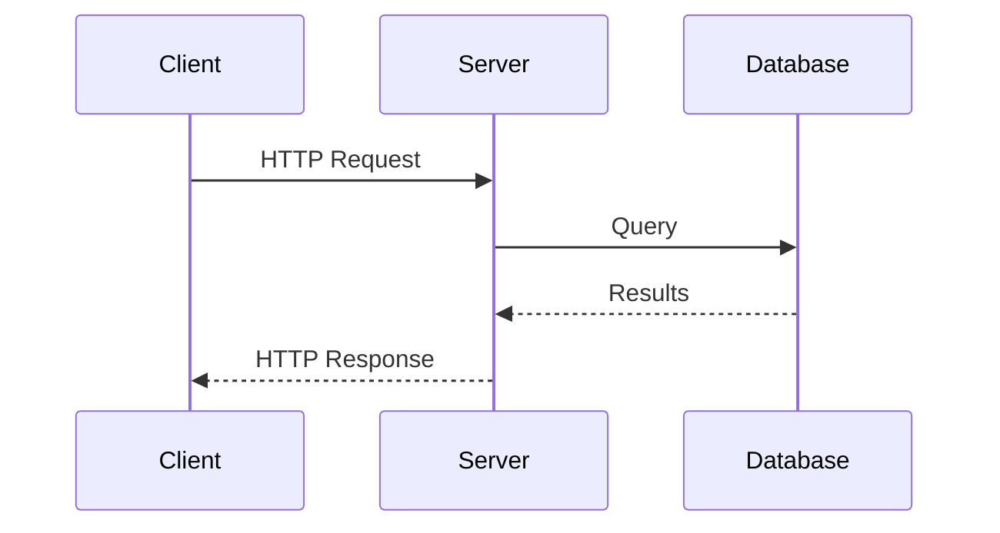

# Diagrams

This document tests D2 and Mermaid diagram rendering.

## D2 Diagrams

### Simple Flow

```d2
User -> API: request
API -> Database: query
Database -> API: result
API -> User: response
```

### Component Diagram

```d2
direction: right

Frontend: {
  Web App
  Mobile App
}

Backend: {
  API Gateway
  Auth Service
  Data Service
}

Database: {
  PostgreSQL
  Redis
}

Frontend.Web App -> Backend.API Gateway
Frontend.Mobile App -> Backend.API Gateway
Backend.API Gateway -> Backend.Auth Service
Backend.API Gateway -> Backend.Data Service
Backend.Data Service -> Database.PostgreSQL
Backend.Auth Service -> Database.Redis
```

## Mermaid Diagrams

### Flowchart



### Sequence Diagram



## Regular Code Block

This should still render as a syntax-highlighted code block:

```go
package main

import "fmt"

func main() {
    fmt.Println("Hello, World!")
}
```
