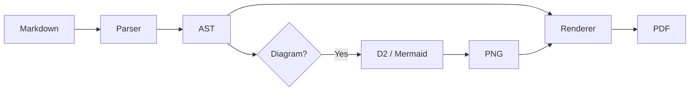

# Phase 7 Verification Document

This document exercises all Phase 7 features: table of contents, orphan protection, and table page breaks with header re-rendering.

## Table of Contents Test

This section exists so the TOC has entries at multiple heading levels.

### Subsection A

Some paragraph text to fill space between headings so the TOC has meaningful entries at different levels.

### Subsection B

More text here.

## Code Block Example

A quick code example to verify mixed content with TOC:

```go
func main() {
    fmt.Println("Hello, PDF!")
}
```

## Short Section Before Long Table

This paragraph precedes a large table that should span multiple pages. When the table breaks to a new page, the header row should be re-rendered at the top.

## Long Table (Page Break Test)

| Row | Name | Description | Status |
|-----|------|-------------|--------|
| 1 | Alpha | First item in the list | Active |
| 2 | Bravo | Second item in the list | Active |
| 3 | Charlie | Third item in the list | Pending |
| 4 | Delta | Fourth item in the list | Active |
| 5 | Echo | Fifth item in the list | Inactive |
| 6 | Foxtrot | Sixth item in the list | Active |
| 7 | Golf | Seventh item in the list | Pending |
| 8 | Hotel | Eighth item in the list | Active |
| 9 | India | Ninth item in the list | Active |
| 10 | Juliet | Tenth item in the list | Inactive |
| 11 | Kilo | Eleventh item in the list | Active |
| 12 | Lima | Twelfth item in the list | Pending |
| 13 | Mike | Thirteenth item in the list | Active |
| 14 | November | Fourteenth item in the list | Active |
| 15 | Oscar | Fifteenth item in the list | Inactive |
| 16 | Papa | Sixteenth item in the list | Active |
| 17 | Quebec | Seventeenth item in the list | Pending |
| 18 | Romeo | Eighteenth item in the list | Active |
| 19 | Sierra | Nineteenth item in the list | Active |
| 20 | Tango | Twentieth item in the list | Inactive |
| 21 | Uniform | Twenty-first item | Active |
| 22 | Victor | Twenty-second item | Pending |
| 23 | Whiskey | Twenty-third item | Active |
| 24 | X-ray | Twenty-fourth item | Active |
| 25 | Yankee | Twenty-fifth item | Inactive |
| 26 | Zulu | Twenty-sixth item | Active |
| 27 | Alpha-2 | Twenty-seventh item | Pending |
| 28 | Bravo-2 | Twenty-eighth item | Active |
| 29 | Charlie-2 | Twenty-ninth item | Active |
| 30 | Delta-2 | Thirtieth item | Inactive |
| 31 | Echo-2 | Thirty-first item | Active |
| 32 | Foxtrot-2 | Thirty-second item | Pending |
| 33 | Golf-2 | Thirty-third item | Active |
| 34 | Hotel-2 | Thirty-fourth item | Active |
| 35 | India-2 | Thirty-fifth item | Inactive |
| 36 | Juliet-2 | Thirty-sixth item | Active |
| 37 | Kilo-2 | Thirty-seventh item | Pending |
| 38 | Lima-2 | Thirty-eighth item | Active |
| 39 | Mike-2 | Thirty-ninth item | Active |
| 40 | November-2 | Fortieth item | Inactive |

## Filler Section One

This section and the ones below exist to push content further down the page, testing orphan protection. When a heading would appear at the very bottom of a page with no room for body text, it should be moved to the next page.

Lorem ipsum dolor sit amet, consectetur adipiscing elit. Sed do eiusmod tempor incididunt ut labore et dolore magna aliqua. Ut enim ad minim veniam, quis nostrud exercitation ullamco laboris nisi ut aliquip ex ea commodo consequat. Duis aute irure dolor in reprehenderit in voluptate velit esse cillum dolore eu fugiat nulla pariatur.

Lorem ipsum dolor sit amet, consectetur adipiscing elit. Sed do eiusmod tempor incididunt ut labore et dolore magna aliqua. Ut enim ad minim veniam, quis nostrud exercitation ullamco laboris nisi ut aliquip ex ea commodo consequat. Duis aute irure dolor in reprehenderit in voluptate velit esse cillum dolore eu fugiat nulla pariatur.

## Filler Section Two

Excepteur sint occaecat cupidatat non proident, sunt in culpa qui officia deserunt mollit anim id est laborum. Sed ut perspiciatis unde omnis iste natus error sit voluptatem accusantium doloremque laudantium.

Excepteur sint occaecat cupidatat non proident, sunt in culpa qui officia deserunt mollit anim id est laborum. Sed ut perspiciatis unde omnis iste natus error sit voluptatem accusantium doloremque laudantium.

Excepteur sint occaecat cupidatat non proident, sunt in culpa qui officia deserunt mollit anim id est laborum. Sed ut perspiciatis unde omnis iste natus error sit voluptatem accusantium doloremque laudantium.

## Filler Section Three

Nemo enim ipsam voluptatem quia voluptas sit aspernatur aut odit aut fugit, sed quia consequuntur magni dolores eos qui ratione voluptatem sequi nesciunt. Neque porro quisquam est, qui dolorem ipsum quia dolor sit amet.

Nemo enim ipsam voluptatem quia voluptas sit aspernatur aut odit aut fugit, sed quia consequuntur magni dolores eos qui ratione voluptatem sequi nesciunt. Neque porro quisquam est, qui dolorem ipsum quia dolor sit amet.

Nemo enim ipsam voluptatem quia voluptas sit aspernatur aut odit aut fugit, sed quia consequuntur magni dolores eos qui ratione voluptatem sequi nesciunt. Neque porro quisquam est, qui dolorem ipsum quia dolor sit amet.

## Lists for Completeness

- Item one
- Item two
  - Nested item
  - Another nested item
- Item three

1. First ordered
2. Second ordered
3. Third ordered

## Mermaid Diagram

A flowchart rendered via mermaid-cli:



## D2 Diagram

An architecture diagram rendered natively via the D2 Go library:

```d2
direction: right

Input: {
  Markdown File
}

Processing: {
  Goldmark Parser
  AST Walker
  Chroma Highlighter
}

Output: {
  PDF Document
}

Input.Markdown File -> Processing.Goldmark Parser
Processing.Goldmark Parser -> Processing.AST Walker
Processing.AST Walker -> Processing.Chroma Highlighter
Processing.AST Walker -> Output.PDF Document
Processing.Chroma Highlighter -> Output.PDF Document
```

## Final Section

This is the final section. If you're reading this in the PDF with a table of contents, every heading above should be clickable from the TOC page.
